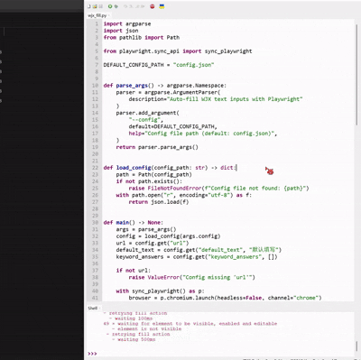

# wjx-autofill

基于 Playwright 的问卷星填空题自动填写脚本，支持按题干关键字匹配答案，题目顺序变化也不影响。

## 亮点

- 按题干关键字填写
- 支持自定义 URL
- 适配常见填空控件

## 快速开始

```bash
pip install -r requirements.txt
python -m playwright install
```

```bash
python wjx_fill.py
```

指定配置文件路径：

```bash
python wjx_fill.py --config "config.json"
```

## 配置答案

在 `config.json` 中编辑 `keyword_answers`：

```json
{
  "url": "https://www.wjx.top/vm/xxxx.aspx#",
  "default_text": "默认填写",
  "keyword_answers": [
    {"keyword": "姓名", "answer": "张三"},
    {"keyword": "学号", "answer": "20240001"},
    {"keyword": "班级", "answer": "计科1班"},
    {"keyword": "QQ", "answer": "123456"},
    {"keyword": "邮箱", "answer": "example@qq.com"},
    {"keyword": "联系方式", "answer": "13800000000"},
    {"keyword": "电话", "answer": "13800000000"}
  ]
}
```

## 目录结构

```text
wjx-autofill/
  README.md
  LICENSE
  config.json
  requirements.txt
  wjx_fill.py
```

## 注意事项

- 请确保你对目标问卷有明确授权，并遵守平台条款。
- 如需自动提交，取消 `submit_button` 的注释并确认按钮选择器匹配。

## 常见问题

**Q: 打开页面后没有自动填写？**
A: 可能是页面未完全加载或控件类型不是 `input[type='text']` / `textarea`。可增加等待时间，或把选择器改成页面实际使用的类型。

**Q: 题目顺序变了会影响吗？**
A: 不会。脚本按“题干包含关键字”匹配，不依赖题目顺序。

**Q: 运行报错 `playwright` 未安装？**
A: 先执行 `pip install -r requirements.txt`，再执行 `python -m playwright install`。

**Q: 需要自动提交怎么办？**
A: 取消 `submit_button` 的注释并检查按钮选择器是否匹配实际页面。

## 运行演示

将 GIF 文件放到当前目录，并在下方替换路径：

```markdown

```
